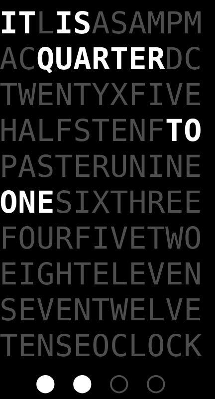

# Cloq

Replicating a [clock's](https://qlocktwo.com/) design
([QLOCKTWO CLASSIC](https://clockforward.com/content/manuals/qlocktwo-classic.pdf))
with slight changes.

Made as an attempt to get familiar with ocaml's
[minttea](https://github.com/leostera/minttea) package.


## Screenshots

   


## Figuring out the time from the clock
Read the currently 'lit up' words to find a time.

Each of the four circles at the bottom represent a minute.
A filled white circle means we should add one minute to the time we figured out from the message displayed.

Number of seconds is not indicated.

## Installation
Dependency versions:
 - OCaml compiler v5.2.1
 - dune: v3.17
 - minttea: v0.0.2
 - spices: v0.0.2
 - ppx\_string: v0.17.0

Doesn't work with OCaml compiler v5.3.0 because a minttea dependency needs <v5.2.2


OCaml compiler v5.2.1 can be installed with opam if it's not already installed:

```bash
opam switch create 5.2.1
```

To build this project itself, first clone this repo and run the following
commands to install the dependencies:

```bash
opam update
opam install minttea spices ppx_string dune
```

Then, build the project and run it:

```bash
dune build
dune exec cloq
```

Press Q to exit.
